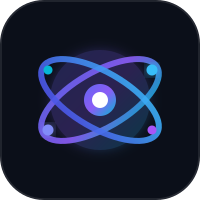
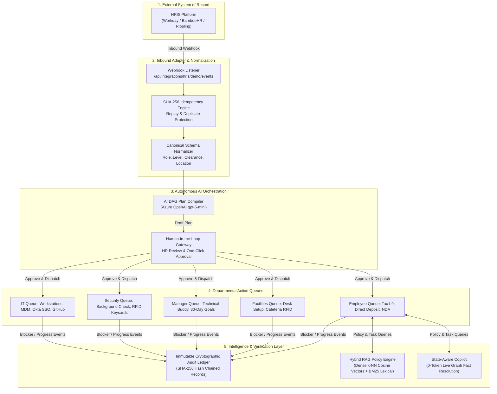

# Omnipresent

<p align="center">
  
</p>

<h3 align="center">Autonomous Cross-Functional Employee Onboarding & Orchestration Fabric</h3>

<p align="center">
  <b>Bridging the gap between HR Systems of Record and enterprise Systems of Execution.</b><br/>
  <i>Engineered by Team Omnipresent: Savio Mohan & Parth Bhavar</i>
</p>

<p align="center">
  <a href="https://onboardflow-amber.vercel.app"></a>
  <a href="https://onboardflow-amber.vercel.app/Omnipresent_Architecture_and_System_Reference.pdf"></a>
  <a href="https://github.com/SavioMohan1/Omnipresent"></a>
</p>

<p align="center">
  
  
  
  
  
  
  
</p>

---

## 📌 Executive Summary

Traditional HRIS platforms (**Workday, BambooHR, Rippling, HiBob, SAP SuccessFactors**) are **Systems of Record**, not **Systems of Execution**. They store contracts, payroll metadata, and home addresses, but they cannot ship laptops, provision Okta SSO credentials, configure AWS/GitHub permissions, or resolve cross-departmental Day-1 blockers.

**Omnipresent is the Air Traffic Control Tower operating above the HRIS filing cabinet.** When a candidate is marked "Hired", Omnipresent non-invasively ingests the event, normalizes the data schema, compiles a role-tailored **Directed Acyclic Graph (DAG)** of 15–20 parallel tasks, and dispatches them into dedicated operational queues for **IT, Security, Facilities, and Engineering Managers**.

---

## 🏗️ End-to-End System Architecture



---

## ✨ Core Innovations & Key Capabilities

### 1. 🧠 Dynamic DAG Plan Compilation (Azure OpenAI `gpt-5-mini`)
Instead of rigid, one-size-fits-all static checklists, Omnipresent analyzes the new hire's exact parameters (seniority, department, location, security clearance level, and tech stack) to compile a custom Directed Acyclic Graph (DAG) of parallel tasks with prerequisite dependencies and SLA estimates.

### 2. ⚡ Hybrid RAG Policy Engine ($k$-NN Vectors + BM25 Lexical Search)
- **Dense Vector Search**: Generates normalized subword vector embeddings and calculates cosine similarity ($k$-NN) over enterprise policies (equipment stipends, remote work, health benefits, security compliance).
- **BM25 Lexical Search**: Uses `MiniSearch` inverted token indices for exact keyword and acronym matching (`MacBook Pro M3`, `Okta SSO`, `Duo MFA`).
- **Reciprocal Rank Fusion (RRF)**: Merges vector rankings and lexical rankings ($RRF(d) = \sum \frac{1}{60 + rank(d)}$) to guarantee accurate answers with exact handbook citations and similarity confidence scores.

### 3. 🎯 Zero-Token Live State-Aware Copilot
Adhering to the architectural principle: ***"Don't spend LLM tokens where deterministic logic can answer."***
When employees query real-time facts (*"What tasks do I have left?"*, *"Is my laptop ready?"*, *"Who is my manager?"*), the Copilot inspects the live operational database directly—returning accurate, instant answers consuming **0 LLM tokens**. Azure OpenAI is invoked strictly for complex policy synthesis.

### 4. 🔒 Non-Invasive HRIS Ingestion & Idempotency
- **Vendor-Agnostic Webhooks**: Consumes inbound events via `/api/integrations/hris/demo/events`.
- **Replay Protection**: Hashes inbound payloads with SHA-256 idempotency keys (`DUPLICATE_IGNORED`), ensuring external network retries never spawn duplicate user accounts or provisioning queues.

### 5. 📬 Built-in Multi-Persona Inbox & RBAC
- Replaces static role dropdowns with a secure credential authentication modal (`🔑 Sign In / Switch`).
- Dynamic operational inbox (`🔔 Inbox`) categorizing tasks into **All**, **Pending Action**, and **Updates** with 1-click execution actions.

### 6. 📜 Immutable Cryptographic Audit Ledger (SOC2 / ISO27001 Ready)
Every state mutation (`ONBOARDING_INITIATED`, `PLAN_APPROVED`, `TASK_BLOCKED`, `TASK_COMPLETED`) is permanently recorded with actor identity, UTC timestamp, and SHA-256 hash chaining to provide tamper-proof compliance evidence.

---

## 📊 Technical Stack Matrix

| Architecture Layer | Technology / Framework | Operational Role in Omnipresent |
| :--- | :--- | :--- |
| **Frontend Presentation** | **Next.js 16.3.6 (App Router) + React 19** | Executive dark mode (`#080c17`), frosted glass panels, SVG orbital logo, dynamic modals. |
| **Styling & Tokens** | **Vanilla CSS & Modern CSS Variables** | Glassmorphism (`16px` backdrop-blur), radial glow gradients, accessible contrast ratios. |
| **Backend API Handlers** | **Next.js Serverless Route Handlers** | Edge & Node.js REST endpoints: `/api/auth/*`, `/api/onboarding/*`, `/api/copilot/*`, `/api/tasks/*`. |
| **AI Foundation Model** | **Azure OpenAI (`gpt-5-mini`)** | Structured output JSON plan generation, dependency graphs, SLA estimates, policy reasoning. |
| **Cloud Enterprise Identity** | **`@azure/identity` SDK** | Zero-secret authentication via `DefaultAzureCredential`, Entra ID, and Managed Identity. |
| **Search & Information Retrieval**| **Hybrid RAG: Dense $k$-NN + MiniSearch BM25** | Subword vector space cosine distances fused via Reciprocal Rank Fusion (RRF). |
| **Data & Compliance Ledger** | **Append-Only Cryptographic Store** | In-memory atomic store with interface-level swap for Azure Cosmos DB / PostgreSQL. |
| **Cloud Hosting & CI/CD** | **Vercel Serverless Edge + GitHub** | Live production deployment, edge CDN routing, automatic Git push deployments. |

---

## 👥 Demo Personas & Credentials Directory

You can sign in to test different operational perspectives using the credentials below:

> **Universal Demo Password:** `Omnipresent2026!` *(or `admin123`)*

| Persona | Name | Username / Email | Operational Perspective |
| :--- | :--- | :--- | :--- |
| 🛡️ **HR Operations** | Helen Reed | `helen.reed@omnipresent.ai`<br/>*(shortcut: `hr`)* | Inbound candidate ingestion, plan approval, and compliance tracking. |
| 💻 **IT Administrator** | Sarah Jenkins | `sarah.jenkins@omnipresent.ai`<br/>*(shortcut: `it`)* | Hardware dispatch, MDM profiles, Okta SSO, and GitHub licenses. |
| 👥 **Engineering Manager** | Marcus Chen | `marcus.chen@omnipresent.ai`<br/>*(shortcut: `manager`)* | Technical mentor assignment, 30-60-90 day engineering roadmap. |
| 🚀 **New Hire Engineer** | Aarav Sharma | `aarav.sharma@omnipresent.ai`<br/>*(shortcut: `aarav`)* | Task checklist, I-9 document upload, direct deposit, and Copilot queries. |

---

## 🧪 Automated Verification & Smoke Test Suite

The entire backend orchestration and AI lifecycle is validated by an automated end-to-end smoke test suite ([`scripts/smoke-test-all.mjs`](scripts/smoke-test-all.mjs)):

```bash
npm run test:smoke
# or: node scripts/smoke-test-all.mjs
```

```text
================================================================
🚀 OMNIPRESENT AUTOMATED END-TO-END SMOKE TEST SUITE
================================================================
--- TEST 1: Health & Integration Diagnostics ---
  ✓ PASS: Server health check responded 200 OK
  ✓ PASS: Azure OpenAI integration configured: true
  ✓ PASS: Azure Managed Identity configured: true

--- TEST 2: Username & Password Authentication ---
  ✓ PASS: HR login with usernameOrEmail + password succeeded
  ✓ PASS: Authenticated role is HR (Helen Reed)
  ✓ PASS: Employee login via username shortcut "aarav" succeeded (Aarav Sharma)
  ✓ PASS: Invalid password correctly rejected with 401 Unauthorized

--- TEST 3: HRIS Inbound Ingestion & Idempotency ---
  ✓ PASS: HRIS event successfully ingested and normalized to DRAFT
  ✓ PASS: Canonical employee email correctly mapped: aarav@onboardflow.demo
  ✓ PASS: Idempotency verified: Duplicate event rejected (DUPLICATE_IGNORED)

--- TEST 4: AI Plan Compilation & Parallel Queue Dispatch ---
  ✓ PASS: Compiled AI plan with 19 parallel tasks
  ✓ PASS: Plan approved and status transitioned to ACTIVE
  ✓ PASS: Dispatched parallel tasks to departmental queues

--- TEST 5: State-Aware Copilot & Hybrid RAG Retrieval ---
  ✓ PASS: Task query resolved via state/graph resolver (Source: STATE)
  ✓ PASS: Zero LLM tokens consumed for live graph fact
  ✓ PASS: Categorized task response returned
  ✓ PASS: Location query resolved via PROFILE fact (Source: PROFILE)
  ✓ PASS: Correct office location returned
  ✓ PASS: Policy query resolved via HYBRID_RAG engine (Source: HYBRID_RAG)
  ✓ PASS: Hybrid RAG citations returned (2 documents cited)
  ✓ PASS: k-NN vector similarity calculated: 49%

--- TEST 6: Task Status Transitions & Operational Blocker ---
  ✓ PASS: Task transitioned to IN_PROGRESS
  ✓ PASS: Task successfully BLOCKED with reason
  ✓ PASS: Blocker reason preserved
  ✓ PASS: Immutable audit event TASK_BLOCKED verified in ledger
  ✓ PASS: Task successfully marked COMPLETED

================================================================
SMOKE TEST SUMMARY: 26 PASSED | 0 FAILED
================================================================
```

---

## 🚀 Getting Started (Local Development)

### 1. Clone the Repository
```bash
git clone https://github.com/SavioMohan1/Omnipresent.git
cd Omnipresent
```

### 2. Install Dependencies
```bash
npm install
```

### 3. Configure Environment Variables
Copy `.env.example` to `.env.local` and add your Azure credentials (or run offline with the built-in deterministic fallback engine):
```env
AUTH_SECRET=demo-auth-secret-change-in-production-12345
DEMO_HRIS_SECRET=demo-hris-secret-synthetic-events-67890

AZURE_TENANT_ID=<your-azure-tenant-id>
AZURE_CLIENT_ID=<your-azure-client-id>
AZURE_CLIENT_SECRET=<your-azure-client-secret>

AZURE_OPENAI_ENDPOINT=https://<your-resource-name>.openai.azure.com/openai/v1/
AZURE_OPENAI_DEPLOYMENT=gpt-5-mini
ENABLE_AI_USAGE_PANEL=true
```

### 4. Run the Dev Server
```bash
npm run dev
```
Open **[http://localhost:3000](http://localhost:3000)** in your browser.

---

## ☁️ Vercel Cloud Deployment

Deploying Omnipresent to Vercel is streamlined with pre-configured project settings:

```bash
# Deploy to preview
npx vercel

# Deploy to production
npx vercel --prod
```

To sync your Azure credentials directly from your local `.env.local` to Vercel production:
```bash
node scripts/sync-env-to-vercel.mjs
```

---

## 📄 Documentation & PDF Reference

An executive and technical manual is included and downloadable from the live cloud deployment:
* **[Download Executive & Architecture Reference PDF](https://onboardflow-amber.vercel.app/Omnipresent_Architecture_and_System_Reference.pdf)**
* **Local Source**: [`docs/Omnipresent_Architecture_and_System_Reference.pdf`](public/Omnipresent_Architecture_and_System_Reference.pdf)

---

<p align="center">
  <b>Omnipresent</b> — Autonomous Enterprise Onboarding & Orchestration Layer<br/>
  Built by <b>Savio Mohan</b> & <b>Parth Bhavar</b> • Team Omnipresent
</p>
